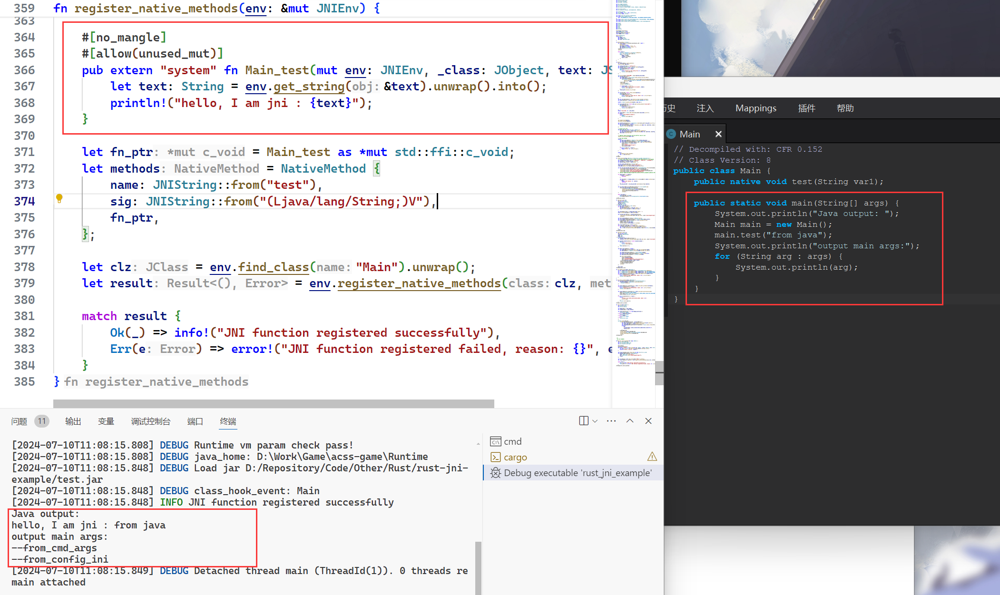

## 介绍

该项目集成了jni和jvmti可以作为一个rust-jni项目的脚手架。

包括：
- 处理JVM Options并创建jvm
- 处理Main Args并调用Java Main函数
- 使用rust实现jni函数并注册到javavm中（register_native_methods函数的使用）
- 使用jvmti的class_event_hook对class进行解密的示例

## Introduce

This project integrates JNI and JVMTI and can serve as a scaffold for a Rust-JNI project.

It includes:

Handling JVM Options and creating the JVM
Handling Main Args and calling the Java main method
Implementing JNI functions in Rust and registering them in the Java VM (using the register_native_methods function)
An example of using JVMTI's class_event_hook to decrypt classes

## 演示/Demo

